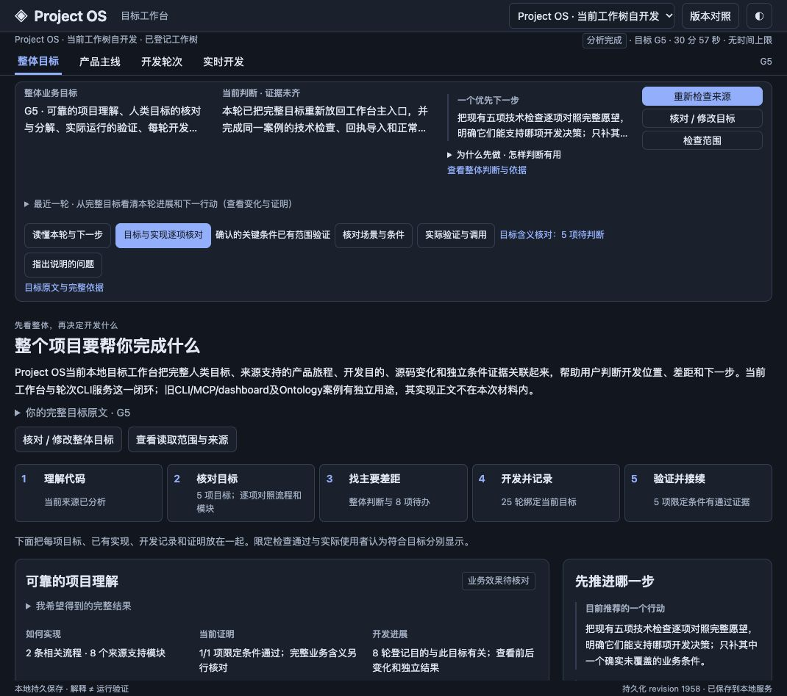

# Project OS · 目标与开发进展工作台

**让每一轮 AI 开发，都能回到你想完成的产品目标。**

Project OS 把完整目标、代码支持的流程与模块、每轮实际变化、检查结果和优先差距放在同一个本地工作台。你可以先看整个项目，再逐项追到模块期望、源码依据和实际回执，判断这一轮究竟推进了什么。

`v0.1.0-alpha.2` 公开 Alpha · MIT · 桌面优先。当前仍需要人核对业务含义、登记开发目的和配置实际检查。

## 从完整目标走到下一轮开发

1. **理解现有代码。** 明确登记项目与读取范围，查看程序理解的用途、来源支持流程、模块职责与连接。产品流程、静态实现关系和实际运行证据分别呈现，无法确认的部分保持未知。
2. **由人核对目标。** 输入你真正想完成的结果，对照程序的解释；逐项检查总体目标和模块期望。保存修正后重新分析，相关映射、差距和建议随新材料更新。
3. **先找主要差距。** 先判断完整主线，再决定修局部还是调整流程。各入口共用一个当前行动；最近一轮的局部成果可以展开，始终保留完整目标和整体判断。
4. **记录每轮实际开发。** 将目的、目标版本、开发前来源、后续代码变化和证明绑定到同一轮。缺少实际事件或前后不可比时如实标注，不从文件数量或 Agent 的“完成了”推算进度。
5. **验证后继续。** 通过登记的本地检查取得结构化回执，查看命令、输出和绑定。失败、修正、旧目标与旧分析留在历史，正常重开后继续使用。

默认“整体目标”可以下钻到产品主线、开发轮次和实时开发。点击“读懂本轮与下一步”逐步核对目标、本轮改善、证明、剩余差距和下一行动；程序不代填读者答案。

## 安装与启动

可以克隆公开仓库，或从 GitHub Releases 下载源码包并进入 project-os 目录。

需要符合 `package.json` 的 Node 版本；本次安装验证使用 Node 24。源码分析还需要本机已安装并配置访问权限的 Codex CLI。使用者负责核对拟发送的数据范围。

~~~sh
git clone https://github.com/rossky094-hub/project-os.git
cd project-os
npm ci
npm run build
npm test
npm run setup -- --source /path/to/your-project --scope src --evidence /path/to/selected-evidence --data /path/to/project-os-data --id my-project --label "我的项目"
npm start
~~~

将占位路径换成实际目录。来源范围必须存在，证据根需由你明确选择，数据目录位于本包和被分析项目之外。服务打印实际的 `127.0.0.1` 地址，打开后选择项目。

安装、登记与初次启动不调用模型。保存目标、反馈、场景或导入结果可能触发分析：登记范围内的源码摘录、目标原话与相关状态会交给你配置的 Codex 服务。先查看“检查范围”；真实分析成本、耗时和取消由使用者自己的环境决定。已有配置与数据不会被 setup 覆盖。

`npm run build` 编译 TypeScript；网页由服务直接读取源码中的 HTML/CSS/JS，启动使用 `npm start`。网页不提供任意 shell 执行接口。

## 当前能证明到哪里

原 Project OS 自例已完成完整目标入口、真实模型重分析、同轮限定回执导入、普通重开和页面使用路径。210 项相关回归与原五项技术条件通过；这属于原案例的软件证据，不是陌生项目准确率或独立新手效果的通用验收。公开包的独立安装和测试结果见 [验证说明](docs/VALIDATION.md)。

当前自开发的 Codex `0.160.0` 使用明确的手工事件登记，自动日志适配尚未验证。事件解析器仅明确识别 `0.155.0-alpha.9.2` 的 native/exec 流及 `0.155.0-alpha.2.6` 的 exec 流；没有实际事件就不显示假想代理活动。目标含义、条件充分性及建议有效性仍需实际使用者核对。

[本地操作](docs/ALPHA.md) · [产品目标](docs/PRD.md) · [实现边界](docs/SPEC.md) · [原案例与证据范围](docs/SELF-CASE.md) · [界面演示](docs/demo.md) · [版本变化](docs/CHANGELOG.md)

公开包只包含工作台所需源码、对应检查、可移植设置与公开文档。`source-manifest.json` 逐文件记录实际来源和 SHA-256。私人案例、原始会话、运行数据、凭据和内部历史仓库不在包中。

## 许可

[MIT](LICENSE)，版权归 2026 rossky094-hub 所有。
