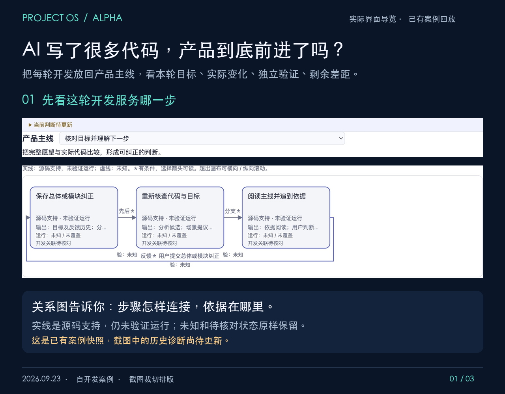

# Project OS Alpha · 目标工作台

**AI 写了很多代码，产品到底前进了吗？**

Project OS 把每轮开发放回产品主线，让你一起看本轮目标、实际变化、独立验证和剩余差距。当前是本地运行的 Alpha 源码预览；初次登记范围、确认场景和配置验证检查仍需熟悉项目的人协助。

**[观看 48 秒实际界面导览（MP4）](docs/media/project-os-case-walkthrough.mp4)** · **[按步骤阅读真实案例](docs/demo.md)**

这是 Project OS 自开发案例的**已有案例回放**，由 2026-09-23 的真实界面截图裁切编排，配有中文字幕；不是连续现场录屏，也不是新一轮现场分析。

### 这一轮，得到了什么证据？

| 本轮核对条件 | 此前 | 本轮结果 |
| --- | --- | --- |
| 目标、来源与显式主线关联相符，主线与轮次接口指向同一轮 | 未知：无独立回执 | 限定通过，首次取得证据 |
| 开发前后对照有依据，未知或不可比明示 | 未知：无独立回执 | 限定通过，首次取得证据 |
| 正常重开后，关联、前后摘要和既有失败记录保留 | 未知：无独立回执 | 限定通过，首次取得证据 |

**三项通过只说明这些条件有了证据，不能推断改善幅度，也不说明此前功能失败。** 整体目标仍未验收，完整用户旅程仍待核对。截图中的历史诊断已经过时，需按当前来源重新检查。当前未支持的 Codex 版本需手工导入符合约束的事件；新手理解效果和陌生项目可靠性尚未独立证实。

工作方式是：明确人的目标 → 观察已登记来源 → 找出差距与未知 → 选择开发轮次 → 核对前后变化 → 按已确认条件独立验证 → 更新有边界的进展判断。

## 安装与启动

需要 Node.js 20.19+、22.13+ 或 24+ 中 package.json 支持的版本，以及 npm。克隆此仓库后，在仓库根目录运行：

~~~sh
npm ci
npm run build
npm test
npm run setup -- --source /path/to/my-project --scope src --scope README.md --evidence /path/to/evidence --data /path/to/project-os-data --id demo
npm start
~~~

将示例路径换成自己明确允许读取的目录。--source 和每个 --evidence 必须是已有目录；--scope 是相对于来源根的已存在路径，可重复指定；--exclude 可排除登记范围内的目录。--data 必须位于 Project OS 包和来源根之外。未指定 --data 时默认使用本包同级的 project-os-alpha-public-data（实际名称随克隆目录变化）。setup 只生成忽略的 .local/config.json 和指向外部数据目录的 .local/data，不读取源文件、不调用模型；已有配置不会被覆盖。生成的分析器配置为 codex、timeoutMs: null、maxAttempts: 2，即没有固定分析耗时截止、仍可取消且最多尝试两次。服务将实际监听地址写到启动输出，且只接受 127.0.0.1。

打开启动输出中的地址，先核对来源范围和人的原始目标，再运行代码理解。分析会把已登记范围内的源码片段、目标与相关历史发送给本机配置的 Codex CLI 及其提供方；请先确认你有权发送这些内容。默认分析器运行在只读沙箱中。只有明确登记的项目会被扫描，范围外或无法安全读取的内容应保留为未知。工作台不会替你批准模型提出的场景、建议或开发动作。

项目在页面中有三种不同的关系：

1. **产品主线**：用户结果、实际与期望步骤，以及有依据的先后、分支或反馈。
2. **实现关系**：模块之间的调用、数据流或依赖等；源码引用不等于运行证明，也不表示用户旅程的顺序。
3. **开发轮次与证据**：人确认的开发意图、观察到的事件、前后来源和按条件登记的验证回执。Agent 报告完成不自动证明结果通过。

请在页面确认可观察的场景和条件，按当前目标与来源人工关联开发轮次，再导入独立检查结果。旧关联和失败证据保留为历史；来源、目标或确认条件改变后要重新核对绑定。查看 [Alpha 操作说明](docs/ALPHA.md)、[产品目标](docs/PRD.md)和[实现约束](docs/SPEC.md)。

## 版本与限制

- 自动事件观察只支持已验证的 Codex exec JSONL 0.155.0-alpha.2.6、0.155.0-alpha.9.2，以及 Codex native rollout 0.155.0-alpha.9.2。0.155.0-alpha.16 不能据版本号推定为兼容；未支持版本保持显式状态，必要时手工导入符合约束的事件。
- npm run build 只做 TypeScript 编译与类型检查，输出在忽略的 dist/。页面静态文件不随编译复制；npm start 始终通过 tsx 运行源码入口，并从 src/human-goal-workbench 读取页面资源。dist/ 不是独立的运行分发包。
- 合成测试和源码引用不能证明陌生项目可靠理解、真实开发成功或初学者独立看懂。当前 Alpha 尚无独立的新手及陌生项目验收结论；真实案例结论需另附对应证据。
- 本公开包采用 [MIT 许可证](LICENSE)，版权归 2026 rossky094-hub 所有；使用、修改和再分发时须保留许可证中的版权与许可声明。

导出来源与每个选定文件的 SHA-256 见 [source-manifest.json](source-manifest.json)。原有产品源码和回归测试采用审过的已提交版本，另有清单注明的一处可移植性改动；安装文件、文档与 setup 是本包新编写的内容。本地其他未提交实现及私人历史、日志和案例数据不属于导出。
