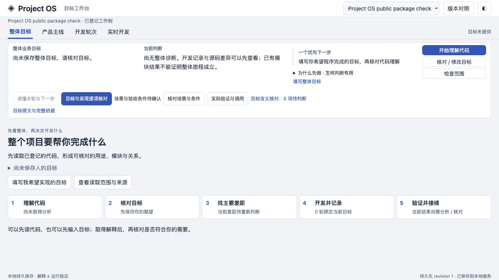

# 公开包独立验证

2026-10-05 · 0.1.0-alpha.2 · 独立公开包

| 检查 | 实际结果 | 证明范围 |
| --- | --- | --- |
| 锁文件安装 | npm 11.9.0，Node 24.14.0；独立 npm ci 成功，96 个依赖。 | 使用候选自身锁文件，未复用原项目 node_modules。 |
| TypeScript 构建 | npm run build 通过。 | 公开源码、脚本及测试的类型编译。 |
| 公开包全部测试 | 19 个文件，284 项通过、0 失败、1 项可选跳过。 | 全部随包公开的测试，保持原断言；不是原仓库全部兼容链检查。 |
| 客户端语法 | node --check 通过。 | 本版实际 client.js。 |
| 实际 setup 与 npm start | 登记包自身来源，数据目录独立；loopback 页面启动成功。 | 可移植入口和真实页面消费。没有加载原案例数据或调用模型。 |
| 页面与来源 | HTTP 返回的 HTML/CSS/JS 与候选字节一致；指定源码 SHA 可读取；真实 CLI 捕获一个开发前快照。 | 静态资产、范围约束与快照入口。 |
| 正常关闭重开 | 同一新数据、14 项状态的存在性及值一致，快照保留。 | 普通接续；原案例的 17 项重开证明另外记录。 |
| 桌面交互 | 四个工作区可键盘切换，范围查看和首次目标窗口实际打开，字段未代填。 | 实际浏览器启动路径，尚无新的业务判断。 |
| 公开文件整理 | 按明确清单扫描本机路径、私人案例、联系信息和凭据形状；无未处理命中。 | 仅公开清单，运行目录和检查原件不打包。 |

唯一跳过项是 project-os-consolidation-input.test.ts 的可选私人冻结输入检查：文件不随公开包提供，保留 skip-if-missing 与全部断言。使用者明确提供 PROJECT_OS_ANALYSIS_INPUT_PREFLIGHT 时仍可运行；其余相关传输检查实际通过。没有通过删除或降低条件制造绿色。

本机沙箱曾拒绝 tsx 的通信管道。保留失败记录后，以支持的本机权限复核原 setup 命令成功，公开源码未改。私有核对脚本另纠正了空会话可选字段和 Vitest 跳过状态的读取；这两处不属于公开实现修改，原输出与修正分别保留。

本版导出 38 份当前工作树源码及测试；公开 setup 与其两项检查沿用已公开字节。唯一当前源码可移植编辑是上述可选输入路径，所有断言保留。source-manifest.json 包含最终逐文件 SHA、来源选择及编辑说明；基线 Git 提交不冒充所有工作树内容的提交状态。

下图是候选包独立安装、正常重开后的真实首次页面。尚未提供目标或开始分析，因此界面保持“目标未提供”和“尚无整体诊断”。

原 Project OS 自例的真实模型、210 项相关检查、五项限定条件与 17 项正常重开证明见 [SELF-CASE](SELF-CASE.md)。本次发布整理复用其适用的软件证据，不新增模型调用，不代替独立新手理解或陌生项目业务验收。当前 0.160.0 自动日志适配仍未验证，原案例采用显式手工事件。

公开包保留 MIT 许可；本版源码包按逐文件清单封装，发布前的独立验证原件与失败历史保留。
