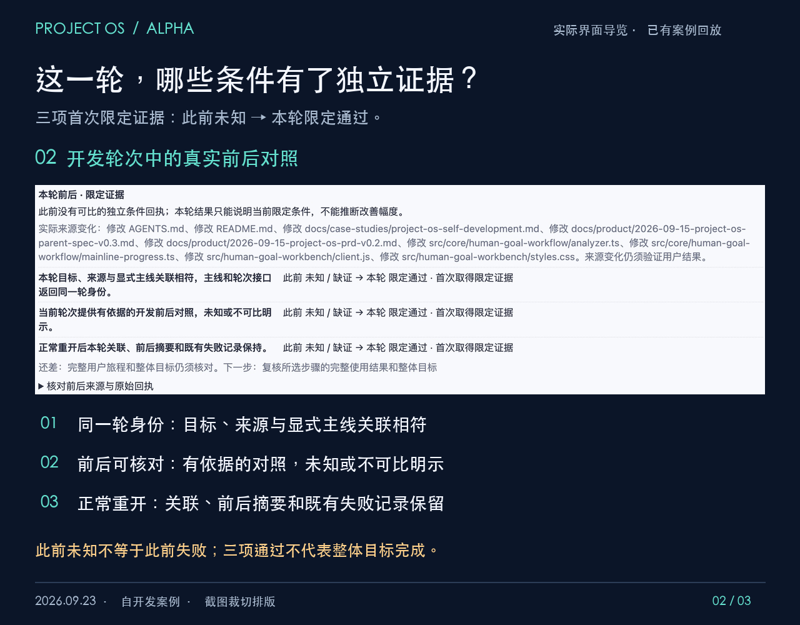
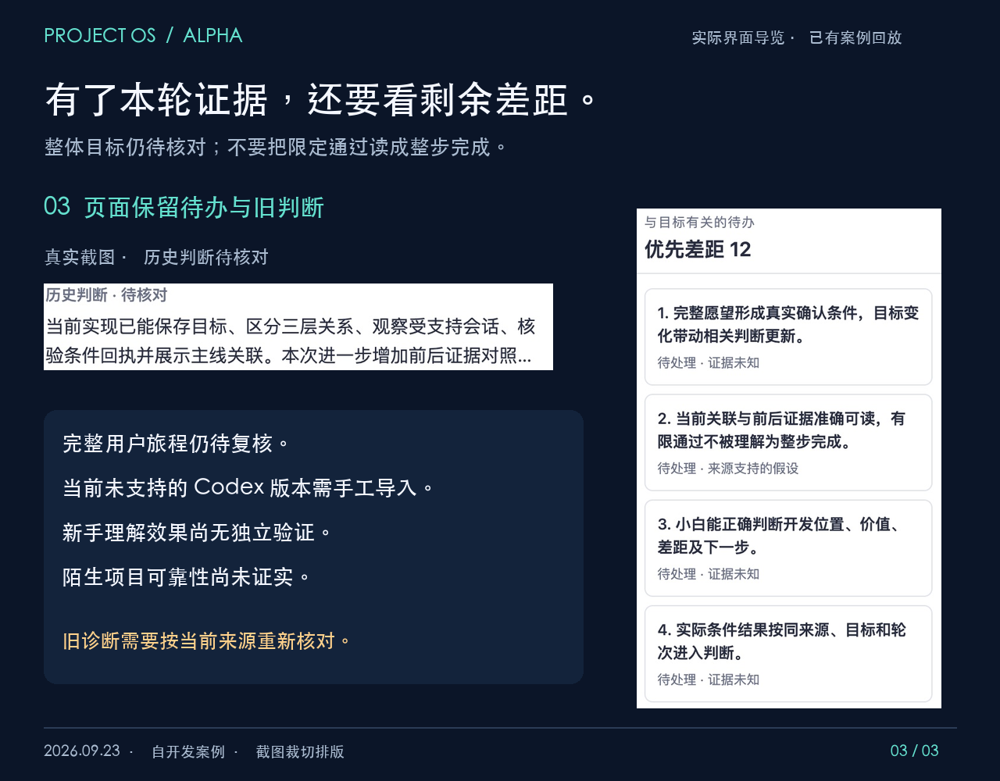

# 一轮开发之后，怎样核对产品进展？

**AI 写了很多代码，产品到底前进了吗？** Project OS Alpha 尝试把本轮目标、实际变化、独立验证和剩余差距放回同一条产品主线。本页用 Project OS 自己的开发案例，展示如何读这些信息。

[观看 48 秒实际界面导览（MP4）](media/project-os-case-walkthrough.mp4) · [返回 README 与安装说明](../README.md#安装与启动)

## 先知道这段演示是什么

这是 **2026-09-23 的实际界面导览／已有案例回放**：真实截图的局部放大与文字说明，有中文字幕、无音轨。它不是连续现场录屏，不演示点击过程，也不代表刚完成了一次新的现场分析。公开材料只包含经授权的 Project OS 自开发案例界面，不包含原始会话、私人日志或原始证据文件。

这轮案例取得的是三项条件的**首次限定证据**。此前这些条件没有独立回执，状态为未知；本轮回执为通过。没有可比的此前结果，因此不能计算改善幅度，不能把未知解释成原来失败，也不能把三项条件通过解释成整体目标已完成。

## 1. 先读产品主线，定位要达到的用户结果

在“产品主线”中，先看选中的旅程和步骤关系，再看节点上说明的依据与未知。画面中的“保存总体或模块纠正 → 重新核查代码与目标 → 阅读主线并追到依据”，展示的是“核对目标并理解下一步”这条旅程。

实线表示源码支持，但仍未验证运行。不能因为图上有节点和连线，就认为用户已经走通这条旅程。原始主线截图中，这条旅程尚无确认关联的开发轮次；后面的进度截图选中的是另一条旅程“从实际开发核对本轮价值”。它们不是同一条件的失败和修复前后。

## 2. 进入本轮，核对目的、来源变化与主线关联

切到“开发轮次”，选择本案例中汇总本轮目标、主线关联、源码变化和独立验证的轮次。先读开发意图和直接产品目的，再核对它对应的目标及来源。

该轮关联到“从实际开发核对本轮价值”，落在“核对本轮对应的主线”和“对照前后结果与下一验证”两个步骤。截图记录了 9 项文件变化，这是工程活动的观察记录，本身不证明产品结果。应继续查看它们对应的条件与独立回执。

本案例的当前 Codex 版本未获自动事件适配支持，轮次列表保留“需手工导入”状态。接入时需导入符合约束的事件，再按目标与来源人工确认关联，并登记独立检查结果。它没有证明所有版本都能自动接入。支持版本和操作步骤见 [Alpha 操作说明](ALPHA.md)及 [README 版本与限制](../README.md#版本与限制)。

## 3. 读前后对照：证据新增在哪里？

| 条件 | 此前状态与原因 | 本轮结果 | 结论边界 |
| --- | --- | --- | --- |
| 本轮目标、来源与显式主线关联相符；主线和轮次接口返回同一轮身份 | 未知；此前同一条件没有独立回执 | 通过；首次取得限定证据 | 只证明本轮所检查的关联一致性 |
| 当前轮次提供有依据的开发前后对照，未知或不可比明示 | 未知；此前同一条件没有独立回执 | 通过；首次取得限定证据 | 不提供量化改善结论 |
| 正常重开后，本轮关联、前后摘要和既有失败记录保持 | 未知；此前同一条件没有独立回执 | 通过；首次取得限定证据 | 只覆盖正常重开，不推广为任意故障恢复可靠性 |

对应案例结果中的三个条件为 `alpha-current-round-binding`、`alpha-before-after-readable`、`alpha-reopen-continuity`；轮次状态为 `verified-scoped`，对照状态为 `unknown-before`，三项转换均为 `new-evidence`。这些是父任务提供的案例证据状态，本次媒体制作没有重新运行这些产品检查。

## 4. 回到剩余差距，确定下一步

界面同时保留“历史判断·待核对”“当前判断待更新”和待办差距。案例结果中的诊断状态为 `stale`，整体目标验收为 `false`。因此本页保留这些标记，不能把旧诊断当作刚验证的当前结论。

下一步仍是复核所选步骤的完整使用结果和整体目标，并按当前目标、场景与来源重新核对诊断。正常重开保持记录的检查，不等于陌生项目可靠理解；三项有限通过，也不等于初学者独立看懂。新手理解效果尚无独立验证，陌生项目可靠性仍未证实。

## 视频阅读顺序

| 时间 | 画面与要点 |
| --- | --- |
| 00:00–00:08 | 产品主线关系图：这轮开发服务哪一步 |
| 00:08–00:16 | 主线进度中的本轮意图与来源变化 |
| 00:16–00:26 | 三项条件：此前未知，本轮首次取得限定证据 |
| 00:26–00:34 | 历史诊断与整体仍待核对的提示 |
| 00:34–00:42 | “需手工导入”的实际界面与接入说明 |
| 00:42–00:48 | 回到产品目标，提示 Alpha 和尚未验证的效果 |

## 截图来源与处理

截图由父任务提供，记录日期为 2026-09-23；日期依据是任务及案例材料，并非由图片元数据推断。案例核对依据为父任务提供的 `live-loop-result.json`，仅提取上述有限结论，原文件不随公开包发布。

三份原始截图只用于生成公开媒体：裁掉浏览器栏与无关标签，裁取产品区域，等比例缩放，并在画面外增加说明文字。没有改写产品界面内容，没有生成或拼造 UI。卡片 1 使用主线截图；卡片 2 使用轮次截图；卡片 3 使用主线截图；视频还使用进度截图。截图中的相对源码路径属于该历史案例，不表示公开包包含其全部源材料。

| 原始截图名称（不公开原图） | SHA-256 |
| --- | --- |
| `mainline.png` | `b3bc1418c62eee55079393daadb506e7bde27f73d44d6404e0130179b5f89339` |
| `progress.png` | `cb7f3e215ff0033fb72f5c3bd8e216e918a95582c4d5d99d6b572aa8e12450be` |
| `round.png` | `ceb0105241de873058061f4b897b183357911a53da3b8be8dfaa5801ea6683c5` |

裁切坐标、原图尺寸、各视频段落的来源和处理方式记录在 [媒体来源记录](media/provenance.json)。坐标以原图像素为单位。此处仅公开原始截图的哈希、名称与必要派生信息，不包含私人来源路径。

## English summary

Project OS Alpha is a local workbench for connecting a development round to product goals, observed changes, independent checks, and remaining gaps. This 48-second captioned walkthrough uses real screenshots from a self-development case captured on September 23, 2026. It is an existing-case replay, not a continuous live recording or a fresh analysis.

Three scoped criteria received their first passing evidence: consistent round binding, an evidence-based before/after view that exposes unknowns, and continuity after a normal reopen. The previous state had no independent receipts, so no quantitative improvement or previous functional failure can be inferred. The whole goal remains unaccepted, and the displayed diagnosis is stale. The unsupported current Codex version requires manual event import. Beginner comprehension and reliability on unfamiliar projects have not been independently established.

[Read the README and installation steps](../README.md).
